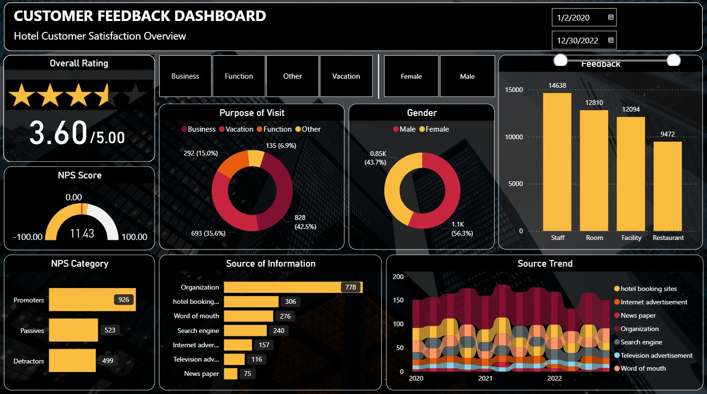

# 🖥️ Customer Feedback Dashboard

## 📚 About Data
This dashboard presents detailed hotel customer feedback from 2020 to 2022, covering overall satisfaction (3.60/5), NPS score (11.43), visit purpose, gender distribution, and feedback volume by service area. It highlights key insights into guest experience drivers, referral sources, and trends across channels like booking sites, word of mouth, and advertisements.

#customerfeedback

## 💡 Highlights

- Overall customer rating stands at 3.60 out of 5, with a Net Promoter Score (NPS) of 11.43, indicating moderate customer satisfaction and loyalty.
- The Staff department received the most feedback (14,638 entries), followed by Room and Facility services.
- Vacation (42.5%) and Function (35.6%) are the top purposes for visits, showing leisure and event-driven stays are most common.
- Female guests (56.3%) provided more feedback than males (43.7%), suggesting higher engagement from female customers.
- Organization (778) is the top source of information, while hotel booking sites and word of mouth show strong and consistent trends across the years.

## ✏️ Data Wrangling
Conducted simple data wrangling and data cleaning:

- Removed rows with missing values
- Cleaned Valuation and Funding columns and cast as float
- Exclude rows with "Unknown" Funding values
- Explode Select Investors column into individual rows for categorical analysis

📍 Jupyter script: Notebook

📍 Clean Data: a.csv

## 📊 Visualization
- Produced a 1-pager dashboard using Power BI.
- Power BI : [Link](https://app.powerbi.com/view?r=eyJrIjoiZGRlZjI3MWYtMDU0Ny00YTY0LWJjMGItYTdiOGY3MjUxYjcyIiwidCI6ImFjZWQ1ODNlLTRhM2ItNDJkZS05ZTQ0LTRlNWFmYTk5Yjk4YSIsImMiOjEwfQ%3D%3D)

